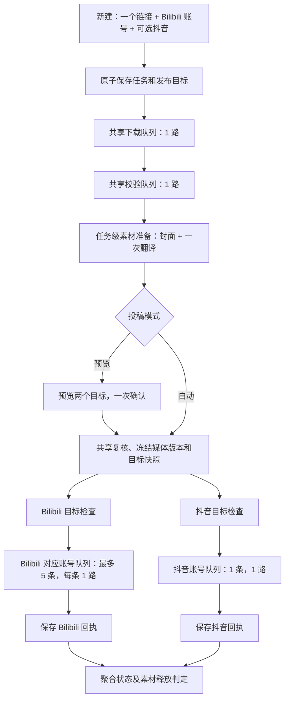

# yt2bili 抖音同步投稿技术实现方案

版本：v1.0 评审稿  
日期：2026-09-25  
对应需求：[抖音同步投稿 PRD](抖音同步投稿PRD.md)。  
状态：设计基准；主要流程已落地，具体模块映射、实现差异及本地验证见[实现与验证](抖音同步投稿实现与验证.md)。未部署、未执行真实抖音投稿验证。  
基线：当前 `main` 的 `4e122eb` 及本次读到的工作区；已有业务代码未提交改动不属于本次文档产出。

## 1. 实施决策

采用“一条素材任务 + 一到两条发布记录”。下载、校验、封面、翻译只服务于父任务；Bilibili 和抖音上传各自运行在账号通道，分别保存授权快照、进度、回执和恢复状态。

用户已确认：预览模式一次确认两个目标；自动模式分别自动发布。程序不等待 Bilibili 成功后才投抖音，也不为抖音重新创建一条下载翻译任务。

抖音采用官方 OpenAPI，不复用 `biliup`。正式接入包括 HTTPS 授权与投稿代理服务：负责应用密钥、OAuth、令牌、官方接口调用和请求去重。该服务是本方案新增依赖，当前仓库没有此服务。服务端只执行由桌面队列显式发起的请求，本期不另建云端定时/后台发布队列。

关键取舍：

- 保留现有 Bilibili 账号表和身份，不为了新增一个平台一次性迁移全部账号模型。
- 两个平台都使用新的发布记录及协调边界，避免 Bilibili 继续修改父任务状态并提前删除素材。
- 保留各任务独立 `work/<task_id>/` 目录；只在同一父任务内部共享素材，不增加跨任务视频缓存。
- 抖音同源同账号冲突时拒绝整次创建，提示用户取消同步后再创建 Bilibili 任务；不让多个父任务隐式共享可编辑的抖音发布记录。
- 复用原视频，抖音仅增加规则检查和投稿参数映射；不新增自动竖屏裁剪、转码、视频拆段或第二次翻译。
- 本地去重不等于抖音接口支持幂等；创建作品回执不明确时保留待核对状态。

## 2. 代码接入点与必须调整的边界

| 现有位置 | 本次核对的行为 | 目标改造 |
|---|---|---|
| `desktop/src/App.tsx::NewTask` | URL、Bilibili 账号、preview/auto、版权确认 | 增加同步开关和抖音身份；保持表单、操作 ID 与能力门禁一致 |
| `desktop/src/Accounts.tsx` | 五账号管理及队列卡片 | 增加抖音 0/1 卡片、一条抖音队列 |
| `desktop/src/types.ts` | Task 只有单一状态及 BV | 增加 `publications`、准备状态和分目标进度 |
| `yt2bili/desktop_service.py::create` | `(video_id, account_id)` 去重，保存父作业 | 原子创建父任务及 Bilibili/可选抖音发布记录 |
| `scheduler.py::AccountLane.work` | 在 Bilibili 账号线程内封面、翻译和上传 | 把准备工作移到独立任务级阶段，账号线程只处理发布 |
| `scheduler.py::active` / `finish` | 以 task_id 保存单执行项，完成即释放 work_lock | 分别登记父作业与发布作业；多个目标完成不重复释放父锁 |
| `upload_coordinator.py` | 直接读 Bilibili 凭据、续期、调用 biliup、更新父状态及清理 | Bilibili 适配器输出平台结果，统一协调层更新目标记录 |
| `db.py` | schema v3，tasks/bv_id、bilibili_accounts、upload_attempts | 增量 schema v4（实施时复核版本占用），新增目标与作业表 |
| `media.py::prepare_upload_video` | 完整 MP4 原样保留，其余按现有规则转换 | 保留策略；新增抖音发布校验，不改变共用媒体 |
| `translation/tasks.py` | 共用翻译后拼接 Bilibili 来源说明 | 保存/复用结构化翻译结果，抖音从中文标题初始化自己的文案 |
| `locking.py` | Bilibili 数字 UID 锁和冷却目录 | 保持旧 Bilibili 路径，新增抖音应用范围身份锁 |
| `task_paths.py` | 检查专属目录、拒绝越界/链接跳转 | 沿用检查，增加资源版本与使用者登记 |
| `bridge.ts`、Tauri capabilities | 仅允许当前固定站点的外链 | 增加确切授权服务及官方站点，禁止泛域名放行 |
| `cli.py`、worker health、preview mock | 单平台 API/状态假设 | 更新协议能力、同步参数、目标级命令及旧参数兼容 |

旧文档中的单账号/schema v1 片段是历史基线，不作为本次数据迁移起点。当前 `translation/service.py::execution_slot` 同时使用进程内锁和组件目录文件锁；拆准备阶段后仍需保留此执行限制。

## 3. 调度结构



### 3.1 准备与发布拆分

新增 `PreparationJob`，继续使用父任务 `desktop_jobs` 保存下载、校验、准备、共享复核阶段。素材准备池建议上限 5，与现有最多五个 Bilibili 通道可同时准备的边界相容；每父任务最多一个准备作业，模型调用仍由现有翻译锁串行保护。

该池不等待账号登录、上传间隔或平台响应。它调用现有 `_prepare_assets` 和翻译服务，共用正常输出后立即结束。不把准备工作塞入新增抖音队列，不让 Bilibili 上传的长请求占住准备线程。

新增 `PublicationJob`，以 `publication_id` 登记执行项。`platform + account_id` 决定发布通道：Bilibili 0～5 条，抖音 0～1 条。下载和校验仍各 1 路，不因为六个上传通道增加其并发。

预览状态无活动上传作业。确认时先安排一次父级复核，再分别检查目标快照并入队；若仅一个平台存在参数错误，仅它进入 `blocked_validation`。自动模式在首次素材校验与生成完成后，校验记录/文件指纹未变可直接冻结，不为两个平台各完整解码一次。

### 3.2 持久顺序与唤醒

- 发布作业保存单调 `sequence`；只有获准发布且目标参数有效才分配上传队列序号。
- 队列头因账号登录、冷却、锁或配额暂停时，不越过它投同账号后面的任务；其他平台继续。
- `failed`、`submission_unknown` 等需要人工处理的目标离开活动队列，不永久堵住后续正常任务。账号级异常另设 `account_pause_reason`，必要时暂停整条抖音队列。
- 正常会话内账号恢复可以唤醒原先 `waiting` 的已授权作业；重试失败项分配新 run_id 与队尾序号，并回到预览。
- 父任务的失败/完成方法不再负责释放所有发布作业。一个平台结束不能从活动表中移除另一个平台。
- 数据库提交成功后发送唤醒；调度器扫描持久作业弥补“提交后、发信号前崩溃”的窗口。

## 4. 数据模型

### 4.1 父任务

保留当前任务身份及 `(video_id, account_id)` 唯一约束；这里 `account_id` 仍是所选 Bilibili 账号，避免破坏现有历史和外键。

新增或明确职责：

| 字段 | 含义 |
|---|---|
| `sync_douyin` | 创建时用户是否选择抖音；只作历史意图，不自动随登录状态变化 |
| `preparation_state` | 共享下载/校验/准备/ready/失败/中断状态 |
| `asset_revision` | 共用媒体与封面的不可变版本 |
| `status` | 用统一 reducer 计算的兼容摘要；禁止某平台直接覆盖 |
| `bv_id` | Bilibili 发布记录的兼容投影，不作为全任务成功或清理条件 |
| `cleanup_state` | 由父级素材管理器维护 |
| `retain_assets` | 人工核对或用户明确保留时为真 |

目标列表固定后不可变。任务级取消只表达共享准备的取消或协调多个未开始目标；每个目标还需要自己的取消位，不能共用一个 cancellation Event 中断另一平台。

### 4.2 `douyin_accounts`

字段：`account_id`（内部 UUID）、`client_key`、`open_id`、`nickname`、`display_id`（可选）、`lifecycle`、`auth_state`、`scope_summary`、`capability_state`、`credential_revision`、`binding_revision`、`broker_grant_ref`、`verified_at`、创建和更新时间。

约束：

- `(client_key, open_id)` 唯一；不得使用 Bilibili 的数字 UID 校验器校验 open_id。
- 对常量 active 槽建立部分唯一索引，使全表最多一行 `lifecycle='active'`；过期或清除凭据仍保留 active 槽。
- `open_id` 和 `client_key` 绑定后不可变；更换身份必须先归档。再次绑定同一历史身份复用其稳定 account_id，避免绕过去重。
- 身份更换递增 `binding_revision`；同身份令牌轮换递增 `credential_revision`。创建表单绑定身份版本，不因正常刷新令牌而误报账号更换。
- 表内仅存代理授权引用和非机密状态；长期令牌存在代理服务的安全存储中，桌面代理会话密钥放系统凭据库，不放 SQLite、前端状态或日志。

登录可用条件为服务端计算的 `can_publish`，综合 active 绑定、有效授权、所需 scope 和应用能力；`can_auto_publish` 还要求自动模式场景获准。不能由前端写入这些布尔值。

### 4.3 `task_publications`

每任务有一条 Bilibili 记录，勾选同步再增加一条抖音记录。

| 字段组 | 建议字段 |
|---|---|
| 身份 | `publication_id`, `task_id`, `platform`, `source_video_id` |
| 账号 | `bili_account_id` 或 `douyin_account_id`，及身份/昵称快照 |
| 状态 | `status`, `revision`, `wait_reason`, `error_code`, `error_summary`, `cancel_requested` |
| 发布意图 | `mode`, `consent_id`, `consent_at`, `consent_kind`, `metadata_revision`, `payload_hash` |
| 产物 | `asset_revision`, `payload_snapshot`, `validation_policy_version` |
| 媒体上传 | `remote_upload_id`, `remote_media_id`, 已确认分片记录或其引用 |
| 投稿结果 | `remote_item_id`, `remote_video_id`, `remote_url`, `receipt_kind`, `submitted_at` |
| 运维 | 创建、更新时间和 `abandon_reason` |

约束：

- `UNIQUE(task_id, platform)`。
- 账号外键分平台指向现有 Bilibili 表和新增抖音表，CHECK 要求只有与 platform 对应的账号字段非空。
- 抖音 `UNIQUE(source_video_id, douyin_account_id)`；account_id 对应不可变 `(client_key, open_id)`。source_video_id 与父任务一致，由事务及触发器/复合外键防止不同步。
- Bilibili 的目标身份应与父任务一致；用复合外键或插入/更新触发器强制，不只依赖 UI。
- 目标身份、平台、源视频不可变；成功回执不能被普通重试清空。
- `payload_snapshot` 不含 Cookie、Token、代理会话凭据。

旧的未绑定 Bilibili 历史任务是特例：允许 Bilibili 发布记录目标为空，但状态受 `legacy_unbound` 门禁；仅历史绑定操作可一次性补齐身份，此后不可变。已有 BV 保留；不可把未绑定历史猜成当前账号。该例外不能用于创建新任务。

### 4.4 作业、尝试和素材记录

- `publication_jobs`：`publication_id` 主键，保存 run_id、owner_session_id、sequence、执行状态和唤醒时间。一次目标执行不能复用父任务 desktop_jobs 槽。
- `publication_attempts`：每次实际尝试记录 attempt_id、publication_id、run_id、phase、started_at、ended_at、payload_hash、客户端请求 ID、代理请求 ID、结果与脱敏错误。phase 至少区分 `upload_media`、`create_intent`、`create_dispatched`、`receipt_saved`。
- 原 `upload_attempts` 保留为历史，只读展示；迁移到新表时保存原 attempt_id/来源并保证幂等，不能继续让新旧表分别成为结果真相。
- `task_assets`：父任务的冻结文件路径、大小、SHA-256、校验版本、asset_revision、manifest 状态；冻结快照存放在任务目录内独立 revision 子目录或只读版本路径。
- `asset_leases`：记录正在读取某 asset_revision 的 owner_session_id、run_id、publication_id；配合父资源管理器处理并发和崩溃恢复，不单靠内存引用计数决定删除。
- `metadata_revision` 以目标为单位；父任务中文翻译版本和平台文案版本分别保存。

### 4.5 创建事务与去重

请求示意（拟新增字段，不是已有接口）：

```json
{
  "url": "https://www.youtube.com/watch?v=VIDEO_ID",
  "account_id": "bili-account-uuid",
  "mode": "preview",
  "sync_douyin": true,
  "douyin_account_id": "douyin-account-uuid",
  "douyin_binding_revision": 3,
  "operation_id": "operation-uuid"
}
```

处理顺序：

1. 规范化单链接和字段，拒绝 sync=false 却携带新抖音目标等歧义请求；老请求省略 sync 时按 false 处理。
2. 优先检查 operation_id 重放。相同规范化请求已完成时返回原结果，不因当前登录过期重复创建；同 ID 不同参数返回冲突。
3. sync=true 时在事务外查询代理授权/能力，拿到绑定身份和授权版本。网络调用不持有 SQLite 写事务或所有 Bilibili 操作共用的长时间锁。
4. 短事务内重读 active 绑定及 binding_revision，检查用户操作期间的登录变化；检查 Bilibili 任务唯一性和抖音投稿唯一性。
5. 原子插入父任务、Bilibili 目标、可选抖音目标、共享准备作业和操作结果。任一冲突全部回滚。
6. 提交后唤醒调度器。平台授权可能在预检后撤销，实际上传前仍需再次检查；这时保留任务，只暂停抖音。

任务重复且平台选择一致返回已有任务；平台选择不一致返回 `TASK_TARGETS_CONFLICT`。跨 Bilibili 账号的抖音重复返回 `DOUYIN_SOURCE_ALREADY_LINKED` 及原任务定位信息，不自动取消用户选中的同步。

## 5. 状态机与快照

### 5.1 每个目标的状态

| 状态 | 语义 / 允许动作 |
|---|---|
| `pending_assets` | 等待共享准备；不允许调用平台发布 |
| `ready` | 内容可预览，尚未取得本次发布确认 |
| `blocked_validation` | 目标素材/文案不合规；可编辑文案、放弃或修正后确认 |
| `queued` | 已确认并待队列执行 |
| `waiting` | 已获发布授权，等待登录、账号锁、冷却或配额 |
| `uploading_media` | 上传字节或分片；尚不代表作品存在 |
| `creating` | 已记录创建意图并准备/已经调用创建作品，取消必须谨慎收敛 |
| `submitted` | 已获得可信作品回执或人工核对登记；不表示审核通过 |
| `failed` | 已知失败且可排除作品已创建，允许人工重试 |
| `submission_unknown` | 可能已创建；只允许查询既有请求结果或人工核对 |
| `cancelled` / `interrupted` | 保留素材，恢复后回到 ready |
| `abandoned` | 用户明确放弃该目标，允许进入清理判定；显式恢复后回预览 |

上传接口、创建接口各自有错误分类。不能把 HTTP 200 当业务成功，必须检查平台业务码及必需回执字段。不能把所有异常归为 failed，也不能把所有文件上传异常都标记可能已发作品。

### 5.2 确认与编辑

默认预览使用一个确认请求，携带父 `asset_revision`、两个 publication_id 和各自 metadata_revision。版本不匹配则返回冲突，要求刷新预览，不能上传用户未看到的内容。

普通“确认双平台”会冻结全部选中目标快照并按各平台检查结果独立安排；平台参数阻塞明确记录。用户已知抖音不合格时，可主动选择“先提交 Bilibili”，抖音保持待处理，后续修正后单独确认。这是部分失败恢复操作，不改变原任务选中的目标集合。

自动模式保留创建时的目标、模式、配置/文案生成策略版本和用户意图记录，准备完成后自动冻结最终内容并入队。自动场景能力未通过时拒绝该组合，不自行改模式。`can_auto_publish` 是产品发布门禁，不是声称抖音存在同名 scope 或接口参数。

单目标编辑先撤销该目标尚未发起的排队授权，待其作业停下后生成新 metadata_revision；在途或已提交目标拒绝修改。另一目标的快照不变。共用视频/封面一旦被任一目标确认，本期不允许原地修改。

### 5.3 主任务摘要

实现唯一 `aggregate_task_state`，在保存目标结果的同一事务中更新父摘要及 Bilibili 兼容 BV。不得采用“最后完成的平台覆盖 task.status”。

推荐判定顺序：

1. 任一目标 `submission_unknown`：摘要为待核对，同时展示其他目标是否仍上传。
2. 所有目标均 submitted：全部已提交。
3. 所有目标为 submitted/abandoned：已结束，并明确放弃项；不称全部成功。
4. 存在 submitted 且另一目标未结束：部分已提交，并带另一目标状态。
5. 存在活动创建/上传/队列项：显示投稿阶段及逐目标进度。
6. 尚无发布，显示共享准备阶段或 ready/失败/取消/中断的明确摘要。

主摘要不能代替运行状态；退出阻塞、可编辑性、日志过滤、历史页和清理判断都查询真实父作业及发布作业。界面 `active()`、`retryable()`、`editable()` 不再只按原 task.status 枚举推导。

## 6. 官方授权和投稿代理服务

### 6.1 选择理由及成本

官方 Web OAuth 要求配置匹配的 HTTPS 回调，换取令牌涉及 Client Secret，官方建议服务端保存和使用凭据。[授权码文档](https://developer.open-douyin.com/docs/resource/zh-CN/dop/develop/openapi/account-permission/douyin-get-permission-code)、[令牌安全说明](https://developer.open-douyin.com/docs/resource/zh-CN/dop/develop/sdk/mobile-app/permission/get-permission-token)

本稿默认一个可配置、自托管的 Python HTTPS 代理服务；部署方式和正式域名在接入阶段确定。它保存 Client Secret、refresh/access token，提供授权状态、流式上传及创建请求端点。桌面仍负责下载、校验、翻译、预览和唯一抖音上传队列。

代价是抖音视频经过一次“桌面 → 代理 → 抖音”中转，增加服务带宽、超时管理和运维成本。采用流式转发和背压，不把 4GB 文件读入内存；默认不长期存视频。如实测需要磁盘暂存，应设限额、生命周期及清理策略并更新交付说明。方案没有把抖音媒体 Token 下发到前端以规避中转成本。

若后续希望完全本地接入，应单独评估允许的授权渠道、开发者自备应用凭据与令牌暴露，不把应用共享 Secret 编进桌面包。现有 Bilibili 功能不依赖代理服务可用。

### 6.2 代理的最小职责

拟议应用内部端点如下，名称不代表抖音官方已存在这些接口：

| 内部端点 | 职责 |
|---|---|
| `POST /v1/auth/sessions` | 建立一次性授权会话，返回官方授权 URL 和会话标识 |
| `GET /v1/oauth/douyin/callback` | 校验 state 并交换 code，记录授权结果 |
| `GET /v1/auth/sessions/{id}` | 只对会话发起方返回脱敏结果；不把 Token 放 URL |
| `GET /v1/grants/{id}` | 账号、权限和绑定状态 |
| `DELETE /v1/grants/{id}/bindings/{binding_id}` | 停用当前桌面配置的绑定与代理权限；不误撤销其他配置 |
| `POST /v1/publications/{id}/media` | 初始化/上传/合并媒体，承接桌面主动流式请求 |
| `POST /v1/publications/{id}/create` | 在平台身份锁和请求台账下创建一次作品 |
| `GET /v1/publications/{id}` | 返回本代理保存的上传/创建结果或 unknown；不假装是审核查询 |

客户端通过部署时的一次性配对凭证加入代理，换取绑定设备/配置的会话；高熵一次性授权会话须与配对身份关联。公开部署若引入多用户，则增加独立主体认证和资源归属校验，不能把知道 grant_id 当作授权。

服务端本期只需一个带持久盘的单实例进程和持久请求数据库。若部署多副本，必须先引入数据库级原子声明/分布式账号锁及 fencing；仅靠线程锁不能保证同账号只有一个创建请求。

### 6.3 OAuth 生命周期

1. 桌面请求授权会话，代理生成随机 state、短期有效期及预期绑定信息。
2. 在系统浏览器打开官方授权 URL。回调只接受匹配 state、有效会话、预设 HTTPS 地址与未消费 code。
3. 代理交换 code，验证应用范围 open_id、授权 scopes 和能力；复登必须匹配原账号。
4. 桌面凭自己的配对会话轮询结果；本地短事务检查单账号约束与 binding_revision 后提交绑定。
5. 并发授权失败、过期回调、取消的会话只清理其临时授权记录，不能覆盖已生效绑定。新授权实际成功但桌面绑定失败时保留可恢复引用并限时回收，避免泄漏或误撤销旧有效授权。
6. 令牌刷新按 `(client_key, open_id)` 串行并版本化保存，遵循响应过期时间；网络故障标记 unavailable，只有明确授权失效标记 expired。
7. 本地退出立即停用本地会话，代理不可达时记录待撤销引用，后续重试；其他平台不等待撤销完成。正式解绑/更换仍须满足无在途/无未处理目标。

账号变更和发布前检查遵循同一个账号锁。不能在网络调用期间持有父任务/数据库全局锁。浏览器只显示官方授权和普通状态；Client Secret、令牌、配对密钥不进入二维码、日志、URL query 或前端事件。

## 7. 抖音发布适配器

### 7.1 契约

建议定义 `Publisher` 协议：`check_capability`、`validate_payload`、`upload_media`、`create_post`、`recover_attempt`，另由账号服务负责授权。所有结果返回结构化状态、平台业务码、可恢复性和回执；既不写父任务状态，也不直接清理素材。

`BilibiliPublisher` 封装现有 biliup 凭据校验、续期和上传；由于 biliup 本身把上传与投稿合在一次调用，其“不确定边界”仍按现有 child started 保护，不能生搬抖音分片阶段的安全重试逻辑。

`DouyinPublisher` 由本地代理客户端及服务端官方适配器组成。桌面目标 ID、run_id、attempt_id、asset_revision 和 payload_hash 在整个调用链保持一致。

### 7.2 素材和文案映射

- 读取父任务冻结的 video.mp4、cover.jpg 和中文标题，无需再次下载、翻译或解码。
- Bilibili 继续使用 title_zh、desc_zh、bili_tags 等现有配置。
- 抖音 `text` 默认等于中文标题；用户修改后以抖音目标快照为准。不复用拼接完成的 Bilibili desc_zh 作为抖音正文。
- 复用同一封面文件上传，取平台返回 image_id 映射到创建参数；官方创建参数名 `custom_cover_image_url` 的实际文档值是 image_id，不把本地路径当 URL 传入。
- 不自动挂小程序、POI、音乐、商业锚点或 Bilibili 专属标签。首期可见范围明确展示为公开提交，审核期间仍可能仅本人可见。
- 横屏保留横屏；不从官方描述中推导“强制竖屏”。对现有 AV1/VP9 MP4 的平台兼容性必须实测；不支持时只阻止抖音并说明原因。

### 7.3 官方调用步骤

当前文档路径均以 `https://open.douyin.com` 为基础：

| 阶段 | 官方路径 | 应保存内容 |
|---|---|---|
| 普通上传 | `/api/douyin/v1/video/upload_video/` | 加密媒体 video_id |
| 分片初始化 | `/api/douyin/v1/video/init_video_part_upload/` | upload_id |
| 上传分片 | `/api/douyin/v1/video/upload_video_part/` | 分片序号及确认结果 |
| 合并分片 | `/api/douyin/v1/video/complete_video_part_upload/` | 加密媒体 video_id |
| 上传封面 | `/api/douyin/v1/video/upload_image/` | image_id |
| 创建作品 | `/api/douyin/v1/video/create_video/` | item_id、真实 video_id、平台 logid |

先检查业务码成功，再读取返回值。上传阶段的 video_id 与创建返回的作品 video_id 分字段保存；不能因为名字相同相互覆盖。

建议超过 50MB 使用分片，超过 300MB 必须分片；正常分片建议 20MB。末片不足最小分片尺寸时如何处理、upload_id 有效期和重复分片语义须在适配验证中确认，再固定切片算法；不能凭“编号相同”假定服务端覆盖幂等。

能力配置初始采用创建文档的 15 分钟、text 1000 字及上传文档的 4GB。部分分片页面同时出现旧的 100MB 文案，边界口径需官方确认/实测，不能以旧页面的单条限制覆盖整个上传策略。严格检查实际文件大小、时长、文案计数及封面上传结果，并保存规则版本。[上传文档](https://developer.open-douyin.com/docs/resource/zh-CN/dop/develop/openapi/video-management/douyin/create-video/upload-video)、[分片初始化](https://developer.open-douyin.com/docs/resource/zh-CN/dop/develop/openapi/video-management/douyin/create-video/video-part-upload-init)

### 7.4 幂等、不确定结果与重试

本地实际尝试开始前先持久化 attempt。代理端以稳定 publication_id 和 payload_hash 记账，并对 `(client_key, open_id, source_video_id)` 建唯一投稿身份，防止同源通过另一配置再发一遍。

- 同请求 ID、同 payload_hash：返回已有台账或继续安全的媒体阶段。
- 同请求 ID、不同内容：409 冲突，不能把新内容伪装成请求重试。
- 不同本地任务命中服务端既有同源身份：返回已有目标状态或重复提示，不新发作品；已完成且身份一致的可信回执可标记复用，不能覆盖其文案。
- 已成功的媒体上传可以在确认资源仍有效时复用；媒体缓存失效只重传媒体。
- 分片重试仅在官方重复语义已验证时重发该片；否则丢弃本次远端临时资源并重新上传，仍不调用第二次创建。
- 调用创建前在本地和代理记录创建意图；代理串行取得账号执行权，提交事务后才发起 HTTP。
- 发起创建后超时、连接断开、5xx、业务结果不明确或成功响应无法持久化，进入 unknown。HTTP 客户端禁止对该 POST 自动重试。
- 桌面丢回执但代理已持久化成功：查询代理台账补回结果，不新调用抖音。
- 代理发出请求后自身崩溃：台账留在 creating/unknown；不能仅凭租约过期认定从未提交。只有可信回执补回或人工核对之后才能继续。
- 明确业务拒绝且可证明未创建，才归 failed/账号等待；令牌刷新后的重发也必须满足该条件。

不承诺跨平台回滚或严格 exactly-once。保护目标是“未知时不再发第二次”，在已获得确定回执时收敛本地和代理记录。

平台审核不在本期自动追踪范围；代理查询端点只查询自有请求台账。SDK 的 share_id 回调也不能被当作该 OpenAPI 创建流程的通用审核回调。

## 8. 身份锁、素材使用与清理

### 8.1 账号锁和冷却

- Bilibili 保留现有真实 UID 锁路径，保证升级后与其他 profile 的 Bilibili 互斥仍有效。
- 抖音本地锁键为 `douyin + client_key + open_id`，对规范化元组做安全哈希作为目录名；不把 open_id 直接拼路径。
- 代理同一账号串行处理整个上传/创建会话，本地抖音队列不与代理形成两个可并发的调度器。媒体 HTTP 分片请求只在持有同一发布会话执行权时进行。
- 代理分布式扩展前提见 6.2；租约过期只释放确定无在途媒体请求的资源，不释放未知创建请求的去重保护。
- 抖音冷却保存最后实际尝试结束时间，按平台返回的退避/配额窗口与本地间隔取更严格值；不能套用 Bilibili 的字符串正则错误分类。
- 配额要区分应用级与用户级；单账号配置下仍不能把应用被封禁误报为用户需重新扫码。

### 8.2 父目录锁与冻结产物

当前 `ScheduledJob` 会跨多个阶段持有 work_lock，再在 `finish` 释放；直接复制一个 ScheduledJob 给两个平台会造成重复释放、父作业过早完成或两平台互相死锁。

新增 `TaskAssetManager`：

1. 共享准备持有父目录独占 work_lock，生成视频/封面和 manifest；两个平台共享只读的同一 asset_revision。
2. 确认及发布前检查最新文件指纹；文件与已确认 manifest 不符则阻止对应待发目标，回预览处理。排队时间很长的目标开始前仍核对指纹，不能只信早期验证缓存。
3. 同一个 worker 内，父资源管理器持有一个 OS work_lock 并管理多目标读取租约，不让两个发布线程分别独占同一把锁；从本地注册的 asset lease 并发只读相同文件。
4. 父资源管理器负责释放 OS 锁；单目标结束只归还自己的 lease。所有本地使用者退出后才释放，不能由任意 Publisher 调用目录删除。
5. 系统 profile 锁继续阻止同库 GUI/CLI 双开；另一进程尝试修改同一目录仍受到 OS work_lock 保护。
6. 文件权限、路径检查和句柄策略减少上传期间外部修改；本期不提供原位覆盖入口。若指纹变化，远端临时媒体缓存也失效，不能用旧远端 ID 配新文案版本。

在途目标存在时，重下载/repair/retranslate 必须按其修改范围阻止或延后；修复 Bilibili 不能覆盖抖音正在读取的素材。共用媒体已冻结后要重新准备，需所有读者结束、保留已发快照，生成新的 revision 供明确未发目标使用。

### 8.3 清理条件与崩溃恢复

统一 `maybe_cleanup(task_id)` 条件：

- 所有选中 publication 为 submitted 或用户明确 abandoned；
- 无共享准备作业、未完发布作业、活动 asset lease 或可能仍存活的上传进程/代理请求；
- `retain_assets=false`；路径安全检查通过。

取消、失败、等待登录、待核对均不满足清理条件。取得 Bilibili BV 后只保存回执并触发统一检查，不能直接走现有 `UploadCoordinator.cleanup`。

事务先设置 cleanup_state=pending，在父资源锁下重读终态和版本、禁止新恢复作业抢入，再执行受限目录删除，最后记录 done/failed。清理与显式恢复/repair 共用父级互斥；用户在清理完成后恢复 abandoned 目标则重新准备并回预览，已提交目标不重发。

启动后只回收已确认失效的进程/会话 lease。存在残留 biliup 子进程或代理在途请求时先核对，不按时间到期盲删。人工登记结果设置 retain_assets=true，后续成功分支不得把它清零。

## 9. 桌面 RPC、事件与 CLI

### 9.1 拟新增或扩展的 RPC

| 方法 | 关键参数 / 返回 |
|---|---|
| `douyin.auth.status` | 可选刷新；返回脱敏账号、绑定版本、can_publish、can_auto_publish、不可用原因 |
| `douyin.auth.start` / `cancel` | operation_id、session_id、预期账号；返回授权 URL / 会话状态 |
| `douyin.auth.clear` | 当前 account_id/binding_revision；清除本配置登录能力 |
| `douyin.accounts.archive` | 无未处理抖音目标、无在途时归档；保留历史 |
| `tasks.create` | 扩展 4.5 字段；未选同步完全走 Bilibili 路径 |
| `tasks.get/list` | 返回 preparation_state、aggregate status、publications[]；列表不返回完整长文案 |
| `tasks.submit` | task_id、目标集合、asset_revision、目标 metadata_revision、operation_id；只接受任务原有目标 |
| `publications.update_metadata` | 仅对未发目标编辑，expected_revision 防止覆盖 |
| `publications.retry` | publication_id、operation_id；仅该平台恢复并回预览 |
| `publications.cancel/abandon` | 区分暂时取消与明确放弃，检查在途边界 |
| `publications.resolve` | 已提交作品标识 / 用户确认未提交；保存核对来源 |
| `publications.resume` | 同会话账号等待与重启人工继续分开授权；不能解除 unknown |

旧 `tasks.submit(task_id, operation_id)` 仅对单 Bilibili 任务保留兼容；双平台必须带快照版本，否则返回升级提示。父级 `tasks.retry` 只处理共享准备失败；已有平台结果的任务要求目标级重试。旧 `tasks.resolve(bv_id)` 只能核对 Bilibili 分支，不能隐式改变抖音。

### 9.2 前端

- `NewTask` 接收抖音公共状态并刷新；账号身份和同步选择变化时重新生成 operation_id，网络重试相同参数保持原 ID。
- 关闭/重新打开弹窗默认不勾选；从去登录返回保留 URL、Bilibili 选择和模式。
- 不可用原因紧邻开关显示；服务端错误保留表单，给出登录、取消同步或定位已有任务的直接操作。
- 同步账号在表单打开时改变，须清空原意图并要求确认，不能把原勾选自动套到新身份。
- 预览采用同一媒体预览及两份投稿信息。`DouyinPublicationEditor` 默认显示中文标题形成的最终 text，可编辑。
- 两平台进度分别存储在 `progress[publication_id]`，共享准备进度继续按 task_id；不能让抖音进度覆盖 Bilibili 进度条。
- 队列卡片分别显示平台、账号、当前任务、等待数及原因；无抖音绑定时显示未绑定提示，不伪造运行队列。
- 外链先解析 URL，再按协议、确切主机和必要路径允许列表放行；不采用简单字符串前缀或任意 `*.douyin.com`。
- `preview.ts` 补模拟账号状态、目标记录、延迟与错误；返回不可变快照，避免轮询期间共享对象被修改。

### 9.3 事件与 CLI

事件身份：`task_id + publication_id(可空) + platform(可空) + run_id + revision`。前端丢弃过期 run_id/revision 消息。不同分支结果同事务更新其记录和父摘要，再发出事件；数据库是结果真相，事件丢失可通过快照恢复。

worker health 增加 `douyin_sync_v1`、`publication_jobs_v1` 等协议能力。桌面与 worker 不匹配时禁用同步，防止旧 worker 忽略字段后仅发 Bilibili。

CLI `run` 默认 sync=false；拟新增 `--sync-douyin` 时使用唯一已绑定账号，经过同一服务校验。`--auto` 同时作用于两个目标；未开通组合则报明确错误。列表显示平台状态；增加目标级 retry/resolve 命令。CLI 退出/等待条件基于两条发布记录，不因已取得 BV 就提前返回成功。所有需要写库的 CLI 操作沿用 profile 锁。

## 10. 退出、恢复与迁移

### 10.1 退出和恢复矩阵

| 最后持久阶段 | 启动时处理 |
|---|---|
| 下载/校验/封面/翻译运行中 | 父准备中断，保留文件，人工继续 |
| 已确认排队但尚未上传 | publication interrupted；人工继续，不因启动直接发 |
| 媒体上传在途且从未记录 create 意图 | interrupted；查询代理媒体状态，可复用但先回预览 |
| 已记录 create 意图，能由代理证明未发起 | interrupted，允许人工继续 |
| 创建请求可能已发出或证据不完整 | submission_unknown；只查询既有台账，不重发 |
| 代理已保存成功而本地缺回执 | 自动补回该既有回执，不再次投稿 |
| 一平台 submitted，另一平台 interrupted/unknown | submitted 保留；只处理另一目标 |
| submitted / 人工 abandoned | 保持终态，再按资源租约执行可恢复的清理 |

正常退出先停止接收新任务和新发布，再停止未进入创建边界的作业。创建请求等待有限的网络超时及台账保存；无法确认时标 unknown 后安全退出，不无限等远端审核。Bilibili 子进程沿用当前安全收尾，无法证明终止时保留账号占用标记。桌面关闭检查父作业和全部发布作业，不只查看 tasks.status。

### 10.2 schema v3 → v4

实施前再次核对最新 schema，若 v4 已被其他工作占用则顺延，不能覆盖同版本的不同结构。

1. 持有 profile 独占锁，确认没有运行中任务，用 SQLite backup API 建立不覆盖旧备份的 `.pre-v4.bak`；含 WAL 的库不能只复制主文件。
2. 明确分阶段迁移：历史 v0/v1/两种 v2 先完成既有 v3 规范化，再显式运行 v3→v4。不能只把 `SCHEMA_VERSION` 改成 4；当前 `_migrate` 的提前返回分支会漏建新表。
3. 在可回滚事务中增加表/字段/索引/触发器，为每个旧任务幂等建立仅 Bilibili 的 publication，并设置 sync_douyin=false。
4. 保留 task_id、Bilibili 账号身份、工作目录、文案、BV、翻译快照、导入映射及原操作记录；旧 BV 不根据新账号登录信息重绑定。
5. 旧 submitted + BV 转 submitted；旧 uploading、submission_unknown 或 submitted 无 BV 转 unknown。ready 保持预览；下载/校验/准备/queued_upload 等未终态保守转中断，不自动发；failed/cancelled 保留恢复含义。
6. 历史未绑定任务按 4.3 特例保留，不推断账号。旧素材已清理则保留空路径，不为了迁移重新下载。
7. 旧 upload_attempts 作为来源回填新尝试记录，唯一来源键保证重跑不重复；旧桌面作业只作为父准备历史，不能转成自动运行的抖音作业。
8. 对旧 operation_id 请求哈希保留版本：老创建请求按原字段哈希识别；新请求纳入 sync、抖音身份及 binding_revision。升级后省略 sync 的旧重放必须仍返回原结果，显式改变目标则冲突。
9. 运行 foreign_key_check、行数/标识/状态映射检查，再提交 user_version；迁移失败回滚并报告，原备份可用。

旧数据导入也走同样的目标记录创建规则；导入包含旧成功/未知结果的文件不能绕过去重或新增抖音投稿。抖音授权引用不随普通项目数据导出为可用凭据。

回滚需要保留当前升级后库和素材，恢复升级前备份并配套旧程序；不能直接把 user_version 写回 3。升级后新增的抖音记录不会出现在旧备份中，回滚说明必须明确这一点。旧程序遇到新 schema 应拒绝启动。

## 11. 文件拆分建议与实施顺序

建议新增模块名称仅为设计，不代表已创建：

| 模块 | 职责 |
|---|---|
| `yt2bili/publications.py` | 发布记录、状态转换、快照、父摘要 reducer |
| `yt2bili/publishers/base.py` / `bilibili.py` | 平台契约及原 biliup 适配 |
| `yt2bili/douyin/accounts.py` / `client.py` / `payload.py` | 单账号服务、代理客户端、文案和限制校验 |
| `yt2bili/asset_manager.py` | 冻结版本、多目标租约、清理 |
| `yt2bili/scheduler.py` | 父准备作业、发布作业和独立队列 |
| `desktop/src/DouyinAccount.tsx` / `PublicationStatus.tsx` | 登录卡片与分平台进度/操作 |
| 独立 `services/douyin-broker/` | HTTPS OAuth、平台请求转发、账号互斥和结果台账 |

阶段与完成条件：

1. **官方接入验证**：申请能力、验证用户授权及允许的自动模式，确定测试账号、HTTPS 服务部署方式、媒体边界。权限尚未拿到时明确只完成模拟开发。
2. **数据与状态基础**：迁移、发布记录、原子创建、去重、摘要 reducer；先让原 Bilibili 流程使用新发布记录并通过回归。
3. **共享准备与素材生命周期**：移出账号通道、支持双读取、禁止提前清理、拆 run_id/取消位/事件；用假抖音适配器证明真实并发和故障隔离。
4. **抖音账号与官方适配**：完成代理、OAuth、单账号约束、令牌刷新、分片/封面/创建、未知结果与服务端台账。
5. **产品交互贯通**：新建开关、预览双目标、自动模式、分平台状态及恢复、队列卡片、CLI/worker 兼容。
6. **真实验证及上线**：用授权内容验证两个平台并行、撤权、部分成功、重启和大文件；验收自动模式后再开启完整功能。

阶段 2～5 的模拟部分可以在外部权限等待期间推进。只有登录页或 mock 成功不能把阶段 4/6 标记为完成；只支持预览模式也不满足用户已经确认的完整需求。

## 12. 测试与验收映射

| 测试层 | 关键验证 | PRD 对应 |
|---|---|---|
| 数据/事务 | 单 active 账号、身份不可变、双目标原子写入、并发去重、旧操作 ID 重放 | AC-05/16/17/20/23 |
| 共享准备 | 同任务两目标只准备一次、保持翻译执行锁、Bilibili 上传阻塞不占准备池 | AC-06/09 |
| 调度并发 | barrier/event 证明两平台重叠、抖音最大一路、五 Bilibili + 一抖音不超六路、FIFO | AC-08/10/11 |
| 状态/资源 | 平台结果乱序提交、不丢 BV、文件在另一平台读取时不删、取消/放弃区别 | AC-14/21/22/28 |
| 内容快照 | stale revision 拒绝、分平台编辑、自动模式策略冻结、文件指纹变化阻止复用 | AC-07/12/25/26 |
| 授权 | 过期 state、错账号回调、双登录争位、scope 缺失、Token 刷新竞争、服务不可用 | AC-01～05/13/20/24 |
| 抖音适配器 | HTTP 200 业务错、分片故障、上传 ID 与作品 ID 分离、创建断线、重复请求 | AC-12/15/18/19 |
| 故障注入 | 本地/代理在 create 前后崩溃、成功保存前后断线、cleanup 中断、残留进程 | AC-18/21/22/28 |
| 迁移/导入 | v0/v1/两种 v2/v3、旧未绑定、已有 BV、无文件、未知提交、回滚拒绝 | AC-23 |
| 桌面交互 | checkbox 门禁、去登录保留表单、目标变化提示、双进度、单目标重试 | AC-01～04/07/14/15/26 |
| 真实授权账号 | 官方能力、普通/分片文件上传、封面、创建作品、并行带宽与兼容编码 | AC-08/13/25/27 |

并发测试使用同步屏障和受控事件断言真实执行区间，不靠固定 sleep 或仅检查队列数量。引入 deterministic 假时钟验证冷却、退避和过期；回执丢失用故障注入证明 create 调用次数不增加。

实现阶段的回归至少覆盖现有 multi_account、stage_queues、pipeline_concurrency、bili_upload、joint_migration、translation、desktop 测试，以及新增 publication/douyin/asset 生命周期测试。前端执行项目可用的类型检查、构建与 Playwright；native worker 冒烟验证 RPC、凭据脱敏和退出等待。真实投稿必须使用已授权账号和内容，并单独记录接口成功、平台审核状态及未覆盖项目。

## 13. 官方依据与待验证项

核对日期：2026-09-25。文档中的具体上限、scope 和 URL 需在实施时再次核对；应用最终获准权限以实际控制台和平台回复为准。

- [创建视频：scope、文案、封面、作品回执](https://developer.open-douyin.com/docs/resource/zh-CN/dop/develop/openapi/video-management/douyin/create-video/video-create)
- [上传视频：文件和分片限制](https://developer.open-douyin.com/docs/resource/zh-CN/dop/develop/openapi/video-management/douyin/create-video/upload-video)
- [分片初始化](https://developer.open-douyin.com/docs/resource/zh-CN/dop/develop/openapi/video-management/douyin/create-video/video-part-upload-init)、[分片上传](https://developer.open-douyin.com/docs/resource/zh-CN/dop/develop/openapi/video-management/douyin/create-video/video-part-upload)、[合并完成](https://developer.open-douyin.com/docs/resource/zh-CN/dop/develop/openapi/video-management/douyin/create-video/video-part-upload-complete)
- [封面图片上传](https://developer.open-douyin.com/docs/resource/zh-CN/dop/develop/openapi/video-management/douyin/create-image-text/image-upload)
- [OAuth 授权码与 HTTPS 回调](https://developer.open-douyin.com/docs/resource/zh-CN/dop/develop/openapi/account-permission/douyin-get-permission-code)、[获取令牌](https://developer.open-douyin.com/docs/resource/zh-CN/dop/develop/openapi/account-permission/get-access-token)、[令牌安全说明](https://developer.open-douyin.com/docs/resource/zh-CN/dop/develop/sdk/mobile-app/permission/get-permission-token)
- [代发能力使用规范](https://developer.open-douyin.com/docs/resource/zh-CN/dop/operation-standard/platform-capabilities/usage-spec)

发布前需落实的具体事项：`video.create.bind` 的申请结果；用户所属账号关系和自动模式是否获准；4GB 的字节口径与末片规则；媒体 ID 的生命周期及重复分片行为；AV1/VP9 MP4、封面和横屏实测；服务域名/配对方式/带宽；代理持久台账的备份恢复。未确认项保留为接入验收门槛，不写成代码已经具备或平台必然接受的能力。
