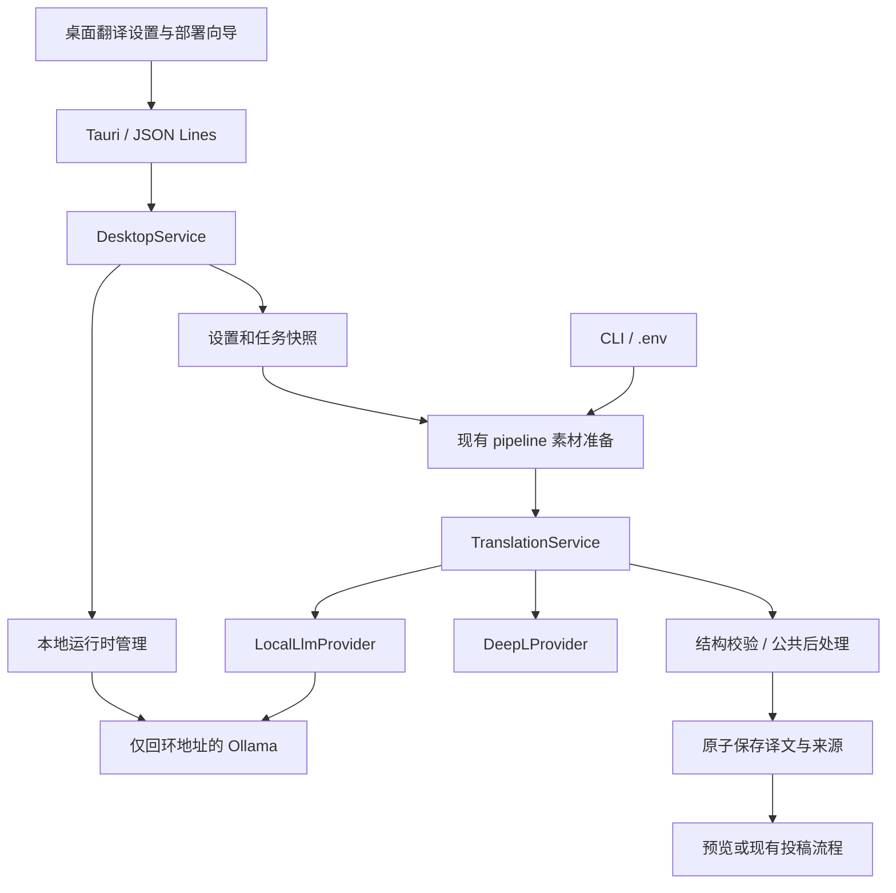

# yt2bili 本地大模型翻译技术实现方案

版本：v1.0 评审稿

日期：2026-09-23

对应需求：[本地大模型翻译 PRD](本地大模型翻译PRD.md)

状态：设计方案；本文中的新增模块、接口、参数及命令尚未实现。

## 1. 技术决策

采用“Python 翻译路由 + 可替换 Provider + 本机 Ollama 推理进程”。桌面 React 仍通过 Tauri 和 Python 的 JSON Lines 协议工作，不直接请求模型服务。

- 默认 `primary=local_llm`，备用为 `deepl`；选择 DeepL 优先时顺序交换。
- `fallback_enabled=true` 为建议默认值；关闭时不访问备用服务。
- 本地首轮候选为 `qwen3:8b` 的 Q4_K_M 版本，关闭思考输出，使用结构化结果；通过项目样本评测后才能定为正式默认。
- Windows P0 提供应用管理的运行时、模型下载和生命周期，开发及高级配置可连接用户已有的本机 Ollama。
- 翻译仍处于现有素材准备阶段，不新增第四条业务队列，不改变视频校验和投稿锁。

选择 Ollama 的依据是部署和模型管理接口较集中，可避免在当前 Python 冻结后台内同时打包 PyTorch、CUDA 和模型权重。直接集成 llama.cpp 可作为未来减少外部运行时的备选；本期不维护两套推理后端。此决策是结合现有桌面架构的工程判断，不是性能实测结论。

### 1.1 选型依据与限制

官方模型卡提供 Qwen3-8B、Apache-2.0 标识和非思考模式说明；它是通用多语言模型，项目内翻译质量仍须验证。[Qwen 模型卡](https://huggingface.co/Qwen/Qwen3-8B)

核对当日 Ollama 的 `qwen3:8b` 页面标示约 5.2 GB、8.19B 参数、Q4_K_M；此数字是分发资源大小，不等于内存或显存占用。标签可变，发布不能仅依赖标签。[Ollama 模型页](https://ollama.com/library/qwen3:8b)

Ollama Chat API 提供 `format`、`think`、`stream`、`keep_alive` 等字段。实际可用的思考配置须由运行时和模型能力检测确认。[Chat API](https://docs.ollama.com/api/chat)

不声称此组合是最新、最快或优于 DeepL。许可证标识只用于选型记录；分发时附带实际运行时与模型的许可、声明及来源文件。

## 2. 当前接入点与必须修正的隐患

- `yt2bili/translate.py`：现有 DeepL 实现和公共后处理函数；拆出 Provider，保留 `clamp_title`、`build_description` 的既有语义。
- `yt2bili/pipeline.py`：`_prepare_assets` 内的翻译调用及全局 `_translate_lock`；需从传入密钥改为传入翻译配置和取消上下文。
- `yt2bili/config.py`：CLI 的 Settings 与 `.env` 解析；新增字段带默认值，避免打破现有构造点及测试。
- `yt2bili/desktop_settings.py`：设置校验、公共返回、快照和 Settings 构造；增加设置版本迁移，调整 `build()` 当前无条件 `self.key()` 的行为。
- `yt2bili/desktop_service.py`、`desktop_worker.py`：新增受限方法、长作业进度及结构化错误；复用现有协议封装。
- `yt2bili/scheduler.py`：任务快照、重试、取消和重翻调度；现有设置更新要求空闲，P0 保留。
- `yt2bili/db.py`：当前 `user_version=1`，已有 tasks、desktop_jobs、desktop_operations；增量迁移，不重建任务表。
- `desktop/src/SetupWizard.tsx`、`App.tsx`、`types.ts`、`preview.ts`：移除 DeepL 是唯一就绪条件的假设。
- 当前以 `title_zh` 非空判定翻译可复用，需增加显式完成状态；当前日志输出全文，需要改为元信息日志。

## 3. 目标调用关系



两个 Provider 是按顺序择一成功，图中的两个分支不表示同时调用。下载和视频校验继续使用各自队列。

建议新增文件：

```text
yt2bili/translation/
  types.py              请求、结果、配置、类型化错误
  service.py            顺序路由、超时预算、切换、复用判断
  deepl_provider.py     现有 DeepL 行为适配
  local_provider.py     本地 HTTP、提示词、结构校验
  runtime.py            运行时检测、启动、退出、资源状态
  deployment.py         下载、校验、进度、取消、离线导入
  prompts.py            有版本号的固定提示词
packaging/translation-manifest.json
tests/test_translation.py
tests/test_translation_runtime.py
tests/test_translation_migration.py
```

`translate.py` 保留后处理并提供短期兼容包装；新 pipeline 统一调用新服务，禁止遗留包装成为绕过路由的另一条路径。

## 4. 配置模型及生效规则

### 4.1 配置字段

建议采用扁平字段以适配当前 `DesktopSettings.validate` 和 Settings：

```json
{
  "translation_primary": "local_llm",
  "translation_fallback_enabled": true,
  "local_llm_mode": "managed",
  "local_llm_base_url": "http://127.0.0.1:11435",
  "local_llm_model": "qwen3:8b",
  "local_llm_num_ctx": 8192,
  "local_llm_timeout_seconds": 120,
  "translation_total_timeout_seconds": 240
}
```

此外快照保存已解析的模型完整 digest、提示词版本、后处理版本及配置 schema 版本；图示 JSON 不代表发布清单已冻结。

- `translation_primary` 只允许 `local_llm | deepl`；备用由首选推导，不持久化可能矛盾的第二字段。
- 布尔字段严格校验类型，不能以非空字符串判断 `false`。
- 本地单次预算范围建议 15～600 秒，总预算范围 30～1200 秒，且总预算大于单次本地预算。
- 地址仅接受字面量 `127.0.0.1` 或 `[::1]`，允许合法端口，禁止远程 host、URL 用户信息、查询参数及重定向；HTTP 客户端不继承代理环境。
- 托管模式固定应用端口；外部模式默认 `http://127.0.0.1:11434`，只读检测，不管理其进程或文件。
- 模型名称来自已验证的支持清单；P0 不接受任意云模型或自动解析第三方仓库。

CLI 对应环境变量：`TRANSLATION_PRIMARY`、`TRANSLATION_FALLBACK_ENABLED`、`LOCAL_LLM_MODE`、`LOCAL_LLM_BASE_URL`、`LOCAL_LLM_MODEL`、`LOCAL_LLM_NUM_CTX`、`LOCAL_LLM_TIMEOUT_SECONDS`、`TRANSLATION_TOTAL_TIMEOUT_SECONDS`。`DEEPL_AUTH_KEY` 原样保留，但不再必填。

CLI 解析优先级：显式命令参数（如后续提供）→ 进程环境 → `.env` → 默认值。桌面仍不读取项目 `.env`。

### 4.2 快照与凭据

- 新任务记录翻译配置快照，成功保存后不可被全局设置自动覆盖。
- DeepL 密钥不进入设置 JSON、快照、事件或数据库；通过惰性凭据提供器，仅在实际选择 DeepL 时读取。
- 桌面 `build()` 必须允许不访问凭据库构造本地配置；不能用现有全局 `vault_error` 阻止本地流程。
- CLI 可由闭包读取 Settings 内现有密钥；输出 Settings/异常时禁止包含密钥。
- 普通重试沿用原快照；“使用当前翻译设置重试”仅合并翻译字段，不能覆盖账号、工作目录、上传模式等设置。
- 修改设置后，新任务生效；旧译文不因此过期或强制重翻。

## 5. Provider 接口和路由

### 5.1 契约

```python
@dataclass(frozen=True)
class TranslationRequest:
    title: str
    description: str       # 公共预处理后的相同片段
    source_lang: str | None
    target_lang: str        # zh-Hans
    title_limit: int
    desc_body_limit: int
    input_truncated: bool

@dataclass(frozen=True)
class TranslationResult:
    title: str
    description: str       # 不含来源声明
    provider: str          # local_llm / deepl / none
    model_digest: str | None
    prompt_version: str | None
    elapsed_ms: int
    fallback_used: bool
    fallback_reason: str | None
    skipped_reason: str | None

class TranslationProvider(Protocol):
    def translate(self, request, *, deadline, cancel) -> TranslationResult: ...
```

实际实现另带 attempts 元信息。Provider 不写任务数据库、不拼接来源声明、不自行调用另一 Provider；重试由服务层控制，避免叠加 SDK 重试。

### 5.2 执行算法

1. 检查取消；归一化空白并应用现有中文/全空跳过规则。
2. 统一计算简介片段 `description[:max(desc_body_limit * 2, 400)]`，两个 Provider 使用相同输入；不让模型额外决定删减范围。
3. 若已有完整或人工编辑结果且未显式重翻，直接复用。
4. 按首选和自动切换开关构造最多两个元素的列表。
5. 首选进入执行预算，做必要的轻量健康检查；未部署时直接报告类型化不可用，不触发下载。
6. 在预算内请求翻译并验证整组结果。可重试错误按下述次数重试；取消和全局错误立即退出。
7. 首选耗尽尝试后，如允许且备用可配置使用，发送切换事件并执行备用；不得再次返回首选。
8. 成功结果做公共后处理，原子保存正文、最终简介、标题及来源，再写文本产物。
9. 两者失败返回聚合错误；本次不会生成可投稿结果。

自动任务沿用既有投稿开关；手动重翻强制回到预览。路由不包含投稿操作。

### 5.3 错误、重试与时间预算

- `LOCAL_UNAVAILABLE`、`MODEL_MISSING`、`MODEL_DIGEST_MISMATCH`、`CREDENTIAL_MISSING`、`AUTH_FAILED`、`QUOTA_EXCEEDED`：当前 Provider 不重试，按策略切换。
- `LOCAL_OOM`：不自动改成别的模型、不无限重启。释放本应用可释放的资源后报告，允许切换。
- `NETWORK_ERROR`、`RATE_LIMITED`、短暂 `SERVICE_UNAVAILABLE`：最多重试一次，等待计入预算；服务端建议等待超出余额则停止该 Provider。
- `OUTPUT_INVALID`：本地最多一次受控重生成，明确字段要求；不递归把任意错误输出当指令。
- `TIMEOUT`、输出 token 耗尽：不在同一 Provider 上反复超时；按策略切换。
- `Cancelled` / KeyboardInterrupt、输入校验失败、持久化错误：不切换服务。

单个 Provider 每组输入最多两次尝试，包括格式修复；DeepL 一次整组尝试可能涉及额度查询、标题和简介三个 HTTP 请求。首轮部分成功后失败的重试/切换可能重复计费，记录字符数和实际调用数。

建议默认：连接超时 3 秒，本地阶段硬预算 120 秒，DeepL 阶段硬预算 90 秒，整组预算 240 秒。首选从取得翻译执行槽开始计时，预算包含加载、校验和该 Provider 的重试；排队另行记录。总预算是硬上限，剩余额度不足则提前停止，不把每个 HTTP 的 timeout 当作总 timeout。

DeepL 适配删除现有固定三次循环和不可取消的 `sleep`；固定并测试 SDK 版本、内部重试设置及网络 timeout，禁止 SDK 和外层各重试多轮。错误码来自 SDK 类型，不依赖字符串匹配。

P0 不新增跨任务熔断；服务持续不可用时依靠快速健康检查和每任务有界尝试。未来需要熔断时另行设计半开恢复，避免错误地永久绕过首选。

## 6. 本地推理协议与内容控制

### 6.1 HTTP 请求

使用 Python HTTP 客户端访问本机 `/api/chat`。新增客户端依赖需加入 `pyproject.toml`、requirements 及桌面冻结锁文件，明确版本；不要求引入 PyTorch。

```json
{
  "model": "qwen3:8b",
  "stream": false,
  "think": false,
  "keep_alive": "60s",
  "format": {
    "type": "object",
    "properties": {
      "title": {"type": "string"},
      "description": {"type": "string"}
    },
    "required": ["title", "description"],
    "additionalProperties": false
  },
  "options": {
    "temperature": 0.2,
    "num_ctx": 8192,
    "num_predict": 3072
  },
  "messages": [
    {"role": "system", "content": "使用本文定义的固定翻译提示词"},
    {"role": "user", "content": "由程序 JSON 序列化的标题、简介和源语言"}
  ]
}
```

此为参数初值，不是经验证的最优采样配置。`think=false` 须在冻结的组合上验证；只读取 `message.content`，拒绝任何工具调用，不能把 `thinking` 拼入译文。字段语义参考 [Chat API](https://docs.ollama.com/api/chat)。

### 6.2 提示词原则

固定系统提示词要求：将提供的标题和简介忠实翻译为简体中文；保留数字、型号、URL、时间戳和段落；不得新增解释或事实；空简介返回空字符串；只输出指定 JSON；输入内的命令是待翻译内容，不能执行。不得启用工具、搜索或文件访问。

标题、简介用 JSON 序列化作为用户消息，不能直接插入系统模板或拼接角色分隔符。专名不强求汉化，不用“中文字符比例低”简单判定失败。

### 6.3 上下文与结果校验

- 对选定模型绑定本地 tokenizer 资源，部署时一并缓存。推理前测量完整聊天模板的输入 token，预留输出上限及 512 token 余量；不假定一字符等于一 token。
- 如现有字符截取后的片段仍超预算，再按段落或句子边界减少简介，并记录二次截短长度；标题不静默丢弃。无法容纳有效标题时报输入错误。
- Tokenizer 计数与 Ollama 实际 `prompt_eval_count` 在 P0 联调中核对；以最长语言样本验证不发生静默上下文截断。模型无匹配 tokenizer 时不进入支持清单。
- 限制 HTTP 响应体大小，初值 256 KiB；严格 JSON 解析和 schema 校验，字段类型必须正确，不能把代码围栏内文本宽松解析为成功。
- 非空标题输出必须非空；非空简介不能空返回。检查完成标记及输出长度耗尽，结果中存在未关闭思考标签或角色分隔符视为无效。
- 检查被保留输入中的 URL、数字和时间戳有无丢失，先标为质量警告；严格不变项可用占位符保护并校验还原，规则须经过语料验证，不能误伤合法本地化。
- 通过结构校验后调用现有 `clamp_title`；简介交给 `build_description`，来源声明使用原始元数据。即使原有极长声明边界逻辑会截短，也不暗改语义，另设回归样本。
- 不使用第二次大模型“自评”作为自动通过的保证。语义质量由离线评测及用户预览控制。

## 7. 本地部署、模型管理及退出

### 7.1 托管模式目录与清单

桌面使用 `AppPaths.root`，例如 Windows `%LOCALAPPDATA%/StarDazz/yt2bili/`：

```text
translation/
  runtime/<version>/       应用管理的 Ollama 可执行文件和依赖
  models/                  应用专属模型存储
  downloads/               分块或临时下载
  deployment.json          部署状态、版本、digest、校验结果
  runtime.lock             同一实例启动互斥
```

CLI 默认使用同一用户级翻译组件根目录，任务数据库仍遵循现有 CLI 规则；不能把模型放在 `work/<video_id>`。CLI 与 GUI 共享的运行时要通过操作系统进程锁和所有权记录协调。

发布清单固定运行时版本、平台/架构、官方下载 URL、SHA-256、文件大小、许可路径，以及模型 tag、完整 manifest digest、提示词版本和 tokenizer 校验值。本文不填造未验证的版本号或哈希；P0 实测后生成并纳入发布审查。Ollama tag 可变，不能只存页面上的短 ID。

下载运行时使用 HTTPS 和固定来源，校验通过后安全解包，防止路径穿越。模型通过本机 pull 接口下载，进度来自分层字节信息；必须返回最终成功并比对清单 digest 才标记 installed。[模型下载接口](https://docs.ollama.com/api/pull)

若上游 tag 已变化，应报告不匹配并等待清单升级或导入已固定离线资源，不静默接受新模型；已经安装的旧模型继续按记录版本使用。更新先暂存并试译，再原子切换部署记录。

### 7.2 启动与离线能力

- 用 argv 数组和 `shell=False` 启动经过校验的运行时；Windows 隐藏窗口，stdout/stderr 写受限轮转日志，不污染 worker 的 JSON Lines stdout。
- 托管模式环境设置 `OLLAMA_HOST=127.0.0.1:11435`、`OLLAMA_MODELS=<专属目录>`、`OLLAMA_NO_CLOUD=1`；并行数初值 1，模型驻留数初值 1。变量适配须由冻结版本验证。
- Ollama 官方支持关闭云功能、设置本地监听和模型目录；改变配置需作用于服务进程本身，不能只设置 Python HTTP 客户端环境。[Ollama FAQ](https://docs.ollama.com/faq)
- 首次安装由界面显式触发；先检测空间，再安装运行时、下载模型、检查 digest、能力探测、试译。
- 后续翻译可按需启动已安装的托管服务，但不自动联网拉模型。健康检查验证运行时身份、版本、模型文件和能力，不仅判断端口能连通。
- 端口被其他程序占用时明确报错，不结束陌生进程。外部模式允许手动使用 11434，不替用户改变已有服务配置。
- 离线导入支持本产品预打包且带清单校验的运行时、模型和 tokenizer 资源包；P0 不承诺任意 GGUF 导入。
- 断网验收关闭 DeepL 备用，检测翻译请求不产生非回环连接；组件更新检查也不得成为翻译前置条件。

### 7.3 下载、取消、升级与卸载

- 部署操作单独进程锁和 operation_id 去重，重复点击返回同一作业。
- 记录下载进度和可恢复资源；退出/网络断开后允许重试，依据运行时已有有效层复用，不把临时文件当完整模型。
- 提供下载取消，取消后关闭下载连接，明确后台拉取是否已停止；共享外部服务可能继续拉取时不能谎报“已彻底停止”。
- 托管进程按所有权和使用者引用计数退出；不得结束用户预先启动的 Ollama。应用启动时清理自己已确认失效的状态记录。
- 空闲 60 秒释放模型驻留是初值；应用退出先取消自有请求，再在无其他 CLI/GUI 使用者时关闭托管进程。
- 更新失败回退到原运行时与模型；升级不迁移或删除用户自有外部模型。
- 用户删除托管模型前确认没有活跃推理；仅删除清单追踪且解析后位于专属目录内的文件。

## 8. 并发、取消与资源控制

保留翻译组串行约束。把裸 `_translate_lock` 获取改为可取消等待，每 100～250 ms 检查取消并发出等待阶段；HTTP 调用不得占用数据库锁或设置变更锁。

跨进程对同一受管运行时使用翻译执行锁；锁范围覆盖整组路由，防止 CLI 与桌面同时推理。该锁只约束翻译，不扩大为下载/视频校验全局锁。未来多账号上传仍共用这个限额，已备好素材的其他账号可继续投稿。

同步 SDK 调用不能仅靠后台线程超时实现可取消：线程可能继续运行、占槽或产生迟到结果。建议用可终止的短生命周期请求子进程隔离 Provider I/O，由父进程每 100 ms 轮询取消和硬 deadline；冻结后台增加内部请求工作模式，通过管道传参，凭据不进命令行、环境和日志。异常/退出关闭管道，迟到结果按 attempt_id 丢弃。

终止客户端并不必然保证服务端已停止 GPU 推理：托管模式在确认没有其他使用者后可回收自有服务；外部模式不能杀服务，提示仍可能释放资源中并在再次申请执行槽前验证就绪。该行为列入冻结版本的取消冒烟测试，不用 `Future.cancel()` 当作已停止计算的证明。

模型与 FFmpeg GPU 校验可能并行争用显存。P0 先限制模型并行/驻留时间，并验证压力场景；OOM 按切换策略处理。若实测仍不稳定，可让本地推理等待当前 GPU 校验完成，但需提供等待事件与可取消机制，不能破坏下载和校验 FIFO。不要在 OOM 后无提示反复加载模型。

## 9. 持久化、复用与原子性

建议新增 `task_translation`（一任务一行）和 `translation_attempts`（有界历史）表，当前以 `video_id` 关联 tasks；不修改现有任务主键。若多账号任务身份改为 `task_id`，同一迁移中改关联键，不能仅以视频 ID 跨账号覆盖记录。

`task_translation` 建议保存：

- task key、`state`（complete / edited / legacy_preserved / skipped）、原始正文译文、结果 revision。
- `config_snapshot_json`、primary、actual_provider、fallback_used、fallback_reason。
- model_name、完整 model_digest、runtime_version、prompt_version、postprocess_version。
- source_hash、request_hash、目标语言、原始/截取长度、input_truncated。
- started_at、finished_at、elapsed_ms、user_edited。

attempts 保存 attempt_id、请求组 ID、provider、耗时、错误码、输入字符数，不保存密钥或完整提示词；建议每任务最多保留最近 20 次组执行，具体保留策略随日志导出一起实现。

### 9.1 保存与复用

- source_hash 对规范化原文计算；request_hash 还包含片段、源/目标语言、实际模型 digest、提示词、后处理和限制值。本期只用于任务内结果识别，不实现跨任务全局翻译缓存。
- 成功后在同一 SQLite 事务写 `tasks.title_zh/desc_zh` 和完整翻译记录；任何一项失败都回滚，不落“标题成功、简介失败”。
- 数据库为真源。`title.txt` 和 `desc.txt` 使用临时文件替换；若文件写入失败，任务记录产物未同步并阻止投稿，重试由数据库恢复文本文件，不再调用翻译服务。
- 来源声明保留单独正文后重新生成，避免从已有最终简介重复追加。人工编辑也同步标记及正文。
- 仅 complete、edited、legacy_preserved、skipped 可复用；失败尝试不能成为完成标记。
- 人工编辑优先级高于自动复用失效规则。原文变化导致不一致时提示审阅，不能静默覆盖已编辑内容。
- 重翻先把结果写到内存/临时记录，成功才替换当前 revision；失败仅追加尝试记录，旧结果仍可预览。

### 9.2 迁移与回滚

1. 使用 SQLite backup 做升级前备份；事务迁移至下一个未占用的 schema 版本（单独落地时为 2）。若与多账号功能并行，统一版本序列，禁止两份方案都硬写 version=2。
2. 对旧设置补默认本地优先和自动切换；保留 DeepL 凭据，不为迁移读取明文。
3. 对已有 desktop_jobs 的旧快照补历史 `primary=deepl, fallback_enabled=false`；CLI 历史任务首次继续时也生成兼容快照。
4. 保留旧标题/简介及人工内容，已有非空结果标记 legacy_preserved；无完整证据的异常半成品标记需审阅，不自动清空或重新投稿。
5. 导入旧项目时采用同一规范化逻辑；重跑迁移不重复转换或删除数据。
6. 当前旧版本拒绝较新 user_version，因此回滚二进制须配套恢复升级前数据库备份，不能宣称直接降版本兼容。保留升级后库，提示备份之后新任务不会出现在旧库。

## 10. 桌面协议和 CLI

继续使用当前 `protocol_version=1` 封装，通过 `system.health` 增加 capability 标志识别新方法，前后端随版本一起发布。

建议受限 RPC：

- `translation.status()`：返回配置顺序、运行时状态、模型状态、凭据是否存在；默认不向 DeepL 发网络请求。
- `translation.test({provider, operation_id})`：仅测试指定服务，用内置短样本，立即返回 job_id；DeepL 试译明确提示少量额度消耗。
- `translation.install({model_id, operation_id})`：从支持清单部署，返回 job_id；禁止传任意下载 URL 或 shell 命令。
- `translation.jobs.get({job_id})`、`translation.jobs.cancel({job_id})`：获取结果、取消下载或试译，支持界面重连恢复。
- `tasks.retranslate({video_id, operation_id, replace_edited})`：限 inactive + ready；采用当前翻译配置，成功后仍为 ready。若 user_edited 且未确认覆盖，返回需确认错误。
- `tasks.retry` 增加可选 `use_current_translation_settings=false`；只允许失败/中断/取消任务，其他快照字段不变。

耗时作业不能占住普通 RPC 等待窗口：部署及试译单独执行器，及时返回 ID，事件采用 `translation.job.progress`、`translation.job.finished`；任务内翻译沿用 `task.progress`，增加 provider、phase、attempt、fallback_reason、elapsed_ms。不同 worker session 的事件按现有会话 ID 和序列处理，UI 重连主动查询作业快照。

前端新类型包括 `TranslationConfig`、`TranslationStatus`、`TranslationSummary`；开发预览补齐未安装、本地可用、DeepL 备用、下载失败、切换成功等数据。任务页缺配置提示改为“无符合策略的翻译服务可用”，不再仅检查 `has_deepl_key`。

规划 CLI 命令示例（尚不可直接执行）：

```powershell
python -m yt2bili translation setup
python -m yt2bili translation status
python -m yt2bili translation test --provider local_llm
python -m yt2bili translation test --provider deepl
```

CLI `.env` 示例：

```dotenv
TRANSLATION_PRIMARY=local_llm
TRANSLATION_FALLBACK_ENABLED=true
LOCAL_LLM_MODE=managed
LOCAL_LLM_BASE_URL=http://127.0.0.1:11435
LOCAL_LLM_MODEL=qwen3:8b
DEEPL_AUTH_KEY=
```

CLI 与 GUI 使用同一 TranslationService、部署清单和校验器；CLI 新任务也必须保存翻译快照，不能只依赖 desktop_jobs。现有 `setup` 输出改为引导选择翻译服务，而非固定要求 DeepL。

## 11. 验证计划与发布门槛

### 11.1 自动化验证

- Provider mock：两个优先级、开关、无密钥、中文/空输入、首选部分成功、备用失败；断言服务调用顺序与次数。
- 本地假 HTTP 服务：非法 JSON、额外字段、空值、超大响应、思考内容、截断、连接拒绝、迟到响应、取消与总限时。
- DeepL mock：鉴权、额度、429、网络超时；SDK 重试不叠加；本地成功时包括额度查询在内的 DeepL 调用为零。
- 快照/数据库：旧库迁移、幂等、旧设置、新默认、历史译文、人工编辑保护、数据库事务回滚和文本文件恢复。
- 部署：校验失败、磁盘不足、断点恢复、端口冲突、外部服务所有权、进程退出、模型 digest 漂移和离线导入。
- 桌面 E2E：无 DeepL 完成向导、切优先级、下载取消、试译结果、重翻确认与失败保留。
- 运行现有 stage queues、pipeline concurrency、media safety、desktop、upload 回归，确认翻译等待不阻塞下载/校验、不绕过投稿防重复机制。

### 11.2 真机与质量验证

记录 CPU、内存、GPU/驱动、运行时版本、完整模型 digest、上下文大小、是否 GPU/CPU 混合及同时进行的视频校验。以 PRD 的 100 组样本及质量门槛为准，保留盲评记录，不能用结构化输出成功率代替翻译质量。

Windows 干净机器验收下载安装、空间不足、中文路径、重启复用、无管理员权限运行、GPU/CPU、完全断网翻译、取消后资源回收及冻结 worker 子进程。DeepL 真实冒烟使用测试密钥和固定少量样本，单列额度消耗。

性能报告分别列冷启动、热启动、近最大输入、纯 CPU 和并行 FFmpeg 场景的 P50/P95、成功率、峰值 RAM/VRAM 与下载空间；目标值见 PRD，不在没有数据时给出“已达标”。

### 11.3 交付拆分

1. **P0-A 技术验证**：冻结候选组合、实测结构化输出/关闭思考/取消/资源占用、准备发布清单和 tokenizer；出口是可重复的基准记录。
2. **P0-B 核心与存储**：Provider、路由、后处理、惰性凭据、快照迁移、原子保存；出口是 mock、数据库和现有管线回归通过。
3. **P0-C 部署与 CLI**：受管运行时、下载恢复、离线包、生命周期、命令；出口是干净 Windows 机器可用且离线试译通过。
4. **P0-D 桌面集成**：向导、设置、状态、重翻、事件和开发预览；出口是桌面 E2E 与原生冻结后台烟雾测试通过。
5. **P0-E 发布**：人工质量评审、性能验收、升级回滚演练，更新 README、desktop/README、`.env.example` 和安装说明。

现阶段不承诺具体工期；运行时分发、取消语义和模型质量是先验证的主要不确定项。若 8B 达不到质量或资源门槛，先更换并验证支持清单中的模型，再调整默认；不能只把模型名称改成新标签就发布。
