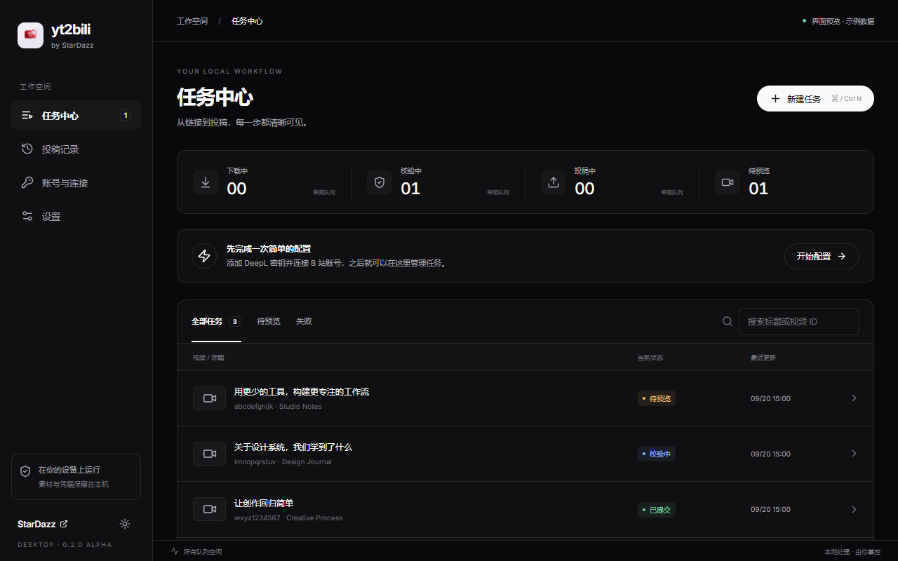
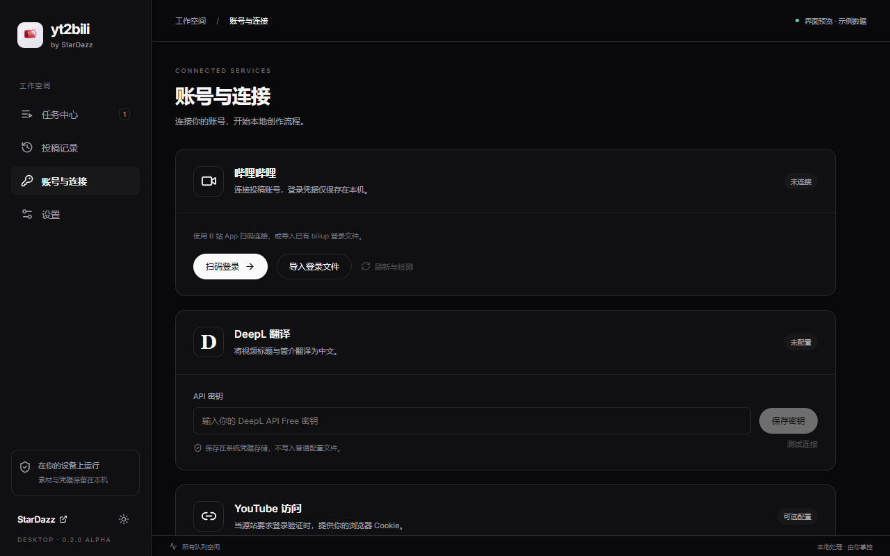
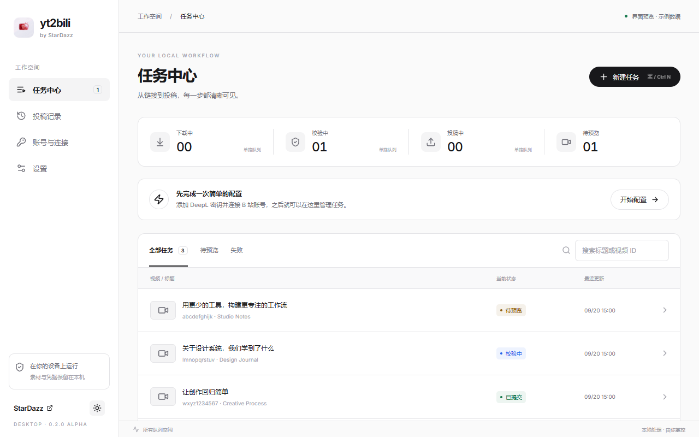

# 第一期开发与验收记录

实施日期：2026-09-20。阶段版本：`0.2.0-alpha.1`。

## 已实现

- StarDazz 黑白灰视觉、Inter 字体、圆角卡片和胶囊按钮；浅色、深色及系统主题。
- 原生 Tauri 开发窗口、单实例、最小 1024×680 布局。
- 任务列表、搜索筛选、分页、阶段状态、下载/校验进度、任务详情、封面及原文译文、日志。
- 单条/批量链接、TXT 导入、默认预览、编辑保存、明确确认投稿、重试、取消、投稿结果核对、只修复素材。
- B 站二维码登录、登录文件导入和刷新；DeepL 系统凭据保存和连接检测；YouTube Cookie 导入/浏览器导出。
- 首次配置向导、目录/上传参数/媒体校验设置、工具诊断、日志导出、旧任务库导入。
- 持续三阶段调度、数据库迁移备份、任务恢复、操作去重、文件锁、账户上传互斥、后台子进程生命周期管理。
- Python 冻结脚本、离线媒体自检、原生通信自检和 Windows CI 配置。

## 通信契约

Rust 只负责本地窗口和 JSON Lines 转发，Python 按方法白名单执行。前端不接触任意命令执行接口。

请求示例：

```json
{"protocol_version":1,"request_id":"1","method":"tasks.create","params":{"text":"https://youtu.be/abcdefghijk","mode":"preview","operation_id":"unique-operation-id"}}
```

成功响应包含 `request_id` 和 `result`；错误包含 `error.code`、`error.message`。任务创建、重试、投稿、修复都需要 `operation_id`，重复操作返回已保存结果。相同任务的状态门禁同时阻止重复提交。

事件包含 `protocol_version`、`event`、`event_id`、`worker_session_id`、`time`、`payload`。主要事件为 `worker.ready`、`task.status`、`task.progress`、`task.log`、`task.repaired`、`queue.changed`、`auth.status`。请求与响应可以交错，通过 ID 关联；前端订阅事件，并每 1.5 秒刷新任务快照恢复漏接状态。

请求大小限制约 1 MB；Rust 响应超时 90 秒。后台最多同时处理 4 个短 RPC，待处理请求限制 16 个；长视频任务入队后立即返回。下载/校验进度节流至约每秒 4 次。取消保留素材，正在上传时等待结果，异常退出后不会自动重投。

二维码事件只携带二维码图片与状态，不携带 Cookie/Token；DeepL 只暴露“是否已配置”。日志导出再次脱敏。

## 本次验证

使用 Windows 本机、隔离临时目录和模拟外部服务响应；没有读取现有账号密钥、执行真实登录或真实投稿。

- 原有 62 项 Python 回归测试通过。
- 新增 23 项桌面后台测试通过，覆盖协议、并发调度、取消恢复、未知投稿结果、五轮媒体重试、修复保留 BV、配置脱敏、数据库备份、共享目录锁、日志导出、二维码成功/过期/取消。
- 5 项浏览器交互测试通过，覆盖首次配置入口、空状态、默认预览、确认门禁、输入不被轮询覆盖、主题与最小窗口布局、未连接后台的错误状态。
- React TypeScript 检查与 Vite 生产构建通过，生产产物不包含开发示例任务模块。
- Tauri 原生 Windows 调试构建与隐藏窗口通信检查通过，确认真实前端请求经 Rust 到达 Python 并返回。
- 源代码后台从非项目工作目录启动，完成协议请求和本地生成视频的 dry-run，达到 `ready` 且未投稿。
- 冻结后台通过同样检查后作为本期打包风险验证产物保留在 `packaging/staging/`，该目录不提交 Git。

## 界面截图

以下为界面开发预览，使用示例任务并明确显示预览标识，不代表真实投稿记录。







## 需要真实账号和平台补验的项目

自动化测试使用模拟服务，不等于外部平台验收。仍需用户在桌面应用内使用自己的 DeepL 和 B 站账号完成扫码、Cookie 刷新、YouTube 下载、实际翻译，并用有权发布的视频确认一次投稿结果与 BV 清理行为。这个过程没有在本次自动执行。

1024×680 浏览器布局已验证；多显示器切换和 Windows 多种 DPI 档位、macOS 真机验收仍需对应设备验证。完整安装、Windows 代码签名、DMG 和 Apple 公证分别属于第二、三期。

启动方法、文件目录及完整测试命令见 [desktop/README.md](desktop/README.md)。

## Windows 启动问题修复（2026-09-20）

- 修复 Windows 同时存在 `PATH` / `Path` 时，启动器拼接 Rust 路径导致 Tauri 子进程找不到 npm 的问题。现在合并路径、去重，并显式保留当前 Node 所在目录。
- 新增 3 项启动环境回归测试，覆盖仅有 `Path`、重复大小写路径变量，以及 macOS 路径规则。
- 增加开发启动前的 Python 依赖检查，避免后台导入失败后仅显示连接超时。
- 本机虚拟环境曾被 Python 3.13 覆盖，但残留 Python 3.12 的 Pillow 等扩展；已按锁定版本重新安装对应解释器的依赖，`pip check` 与后台离线媒体自检通过。
- 通过真实 `npm run desktop` 和根目录 `启动桌面版.cmd` 两种入口验证了 Vite、Tauri 原生窗口及前端到 Python 后台通信，均正常退出。测试使用隔离数据目录，未操作账号或投稿。
